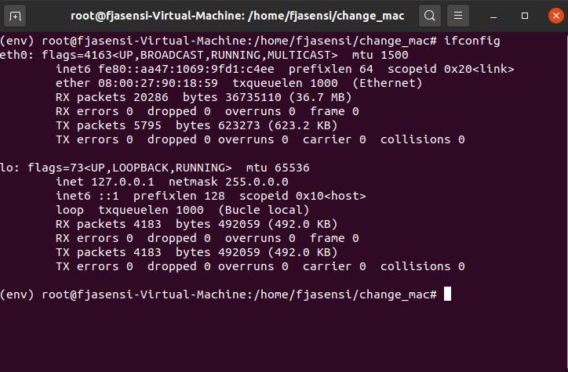
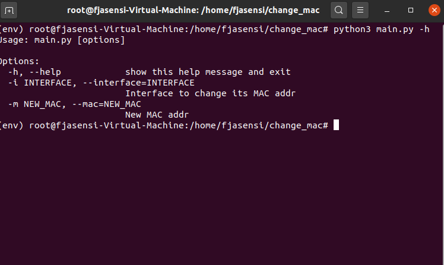
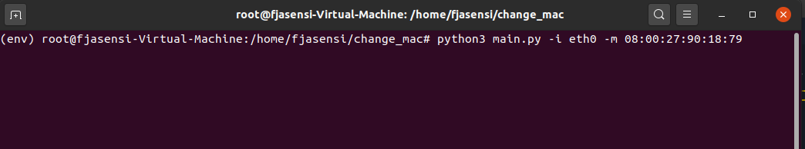
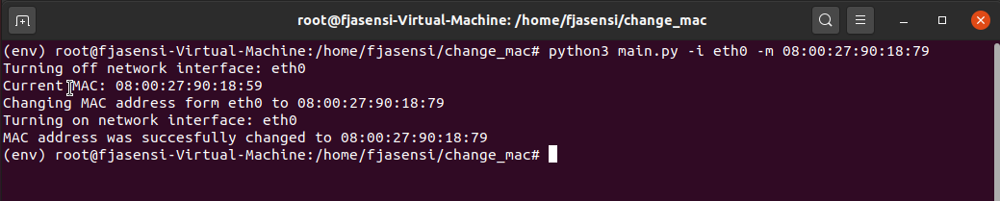

# Cambiar dirección MAC con Python
Con este scrip de Python se puede cambiar la dirección MAC de un equipo por una cualquiera que nosotros elijamos.

## Comenzando 🚀
Prmero debemos saber la interfaz de red que en la que queremos cambiar la dirección MAC, para ello, abrimos la terminal y ejecutamos el siguiente comando:

```
$ ifconfig
```

esto nos dará un resultado parecido a este:



Vemos que la interfaz de red en este caso es **eth0** y que la dirección MAC actual es **08:00:27:90:18:59**

En el fichero [main.py](main.py) está todo el código necesario. 

He definido un pequeño menú de ayuda que describe los parámetros necesarios para poder cambiar la MAC, para ver la ayuda ejecutamos lo siguiente:

Nos ponemos como root:
```
$ sudo su
```

Para ver la ayuda:
```
$ python3 main.py -h
```

veremos algo como esto:



Para cambiar la dirección MAC:
```
$ python3 main.py -i eth0 -m 08:00:27:90:18:79
```



La salida del comando será la siguiente:



Como vemos, los pasos que ejecuta son los siguientes: 

1. Apaga la interfaz de red etch0
2. Dice cuál es nuestra MAC actual
3. Cambia la dirección MAC
4. Vuelve a levantar la unidad de red
5. Nos avisa de que el cambio está hecho

## Pre-requisitos 📋
No tiene por qué hacer falta instalar ninguna librería, ya que suele traerlas el sistema por defecto. El script usa estas:

- subprocess: para ejecutar comando sobre el sistema
- optparse: para las opciones del script
- re: para testear con expresiones regulares que la nueva MAC cumpla con el formato válido
- os: para saber si el usuario es root